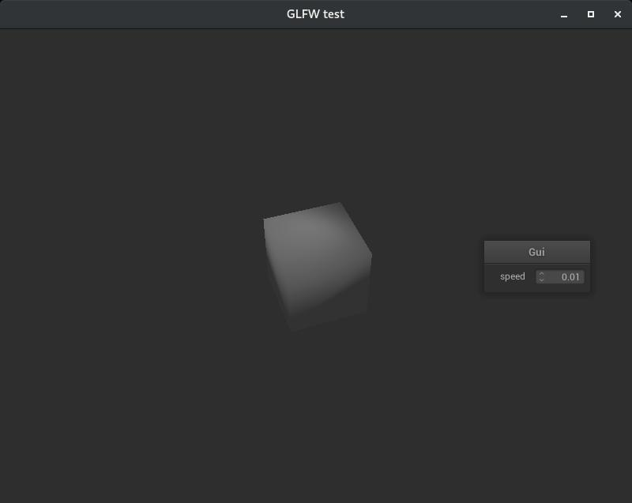

# Radium-NanoGUIApp
Minimalist app powering nanoGUI with Radium Engine




To compile, run
```bash
cmake .. -DCMAKE_MODULE_PATH=YOUR/PATH/TO/Radium-Engine/cmake
```

Dependencies:
* nanogui
* glfw

